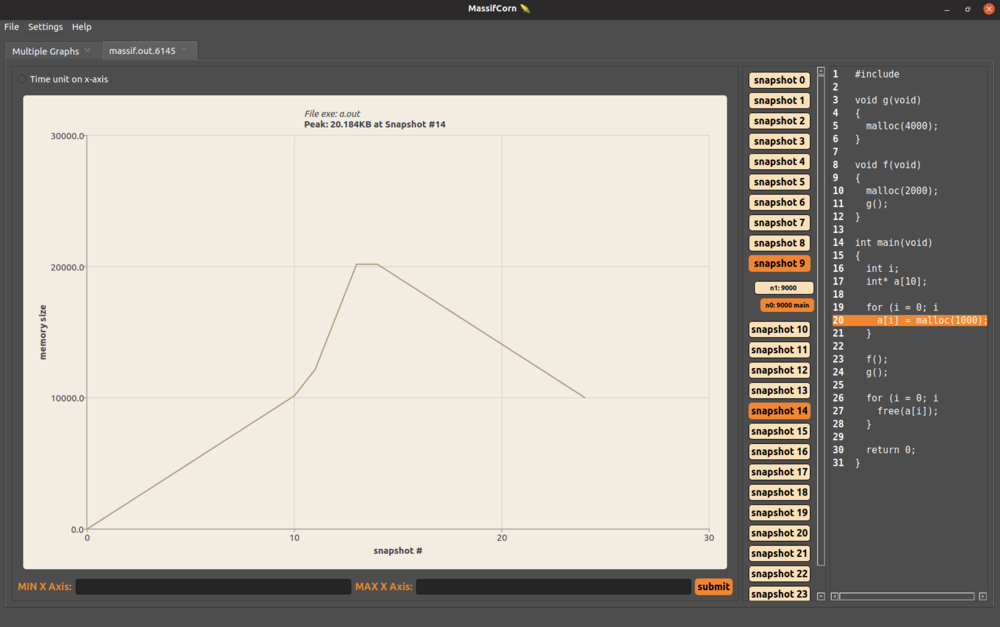
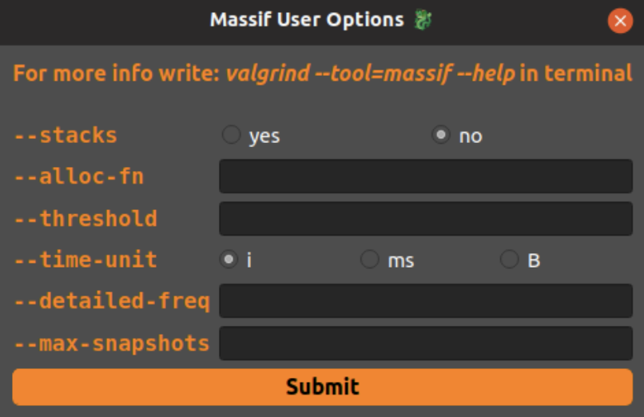
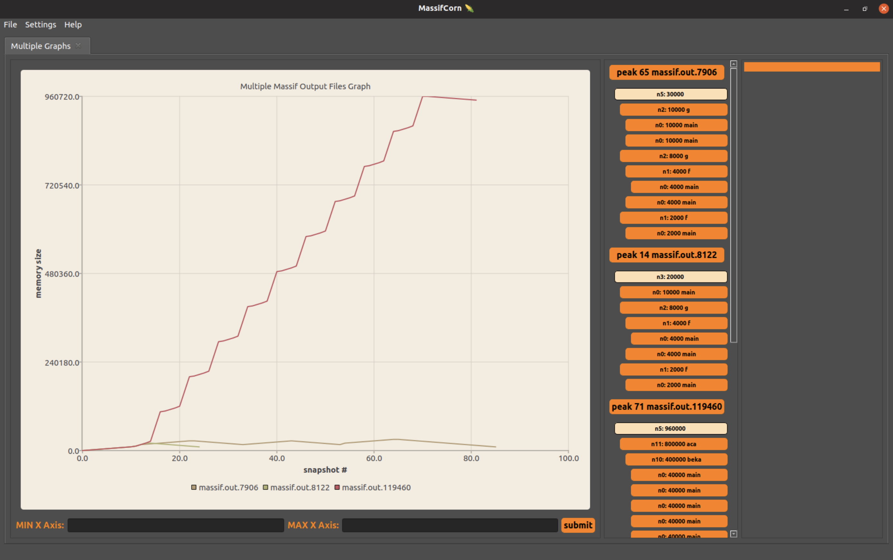
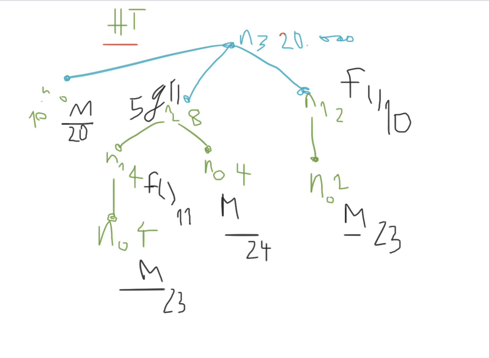

# MassifCorn :corn:

## Kratko o projektu :books:

Aplikacija je nastala u okviru kursa <b>_Verifikacija softvera_</b> na master studijama smera informatike na Matematičkom fakultetu u Beogradu.

Tim koji je izradio aplikaciju se sastoji od 4 studenta:

- Petar Zečević
- Aleksandra Nikšić
- Aleksandar Ranković
- Anđelka Milovanović

Profesorka na kursu: Milena Vujošević-Janičić\
Asistent na kursu: Ivan Ristović

Cilj aplikacije je da vizualizuje tekstualni izlaz iz alata <b>Massif</b>. Alat se nalazi u okviru <b>Valgrind</b> okruženja za instrumentalizaciju koda i pre svega pruža detaljnije informacije o zauzeću memorije na hîpu, uz neke dodatne opcije. Više o alatu se može pročitati na: https://valgrind.org/docs/manual/ms-manual.html.

Mogućnosti koje aplikacija pruža korisniku će biti detaljnije pojašnjene u daljem tekstu.

# Pokretanje aplikacije :rocket:

Aplikacija je rađena u QtCreator okruženju, u programskom jeziku C++, na Linux Ubuntu operativnom sistemu. Za pokretanje aplikacije neophodno je instalirati:

1. Qt5
2. Qt Charts

Ukoliko charts pravi probleme, unošenje sledeće linije u terminal može rešiti probleme:

```bash
sudo apt install libqt5charts5 libqt5charts5-dev
```

Nakon instalacije potrebnih biblioteka, dovoljno je odraditi sledeće korake:

```bash
1. git clone https://github.com/MATF-Software-Verification/2020_05_Massif_Visual.git
2. cd 2020_05_Massif_Visual/
3. ./start.sh
```

Takođe, moguće je uvesti projekat u QtCreator i na taj način pokrenuti aplikaciju.

# Primeri upotrebe aplikacije :chart_with_upwards_trend: :chart_with_downwards_trend: :mag:

U okviru aplikacije postoje 3 opcije koje korisnik može izabrati iz Toolbar-a. Te opcije su:
`File`, `Settings` i `Help`. U nastavku će biti detaljnije predstavljene prve dve opcije, dok se treća ostavlja korisniku za istraživanje.

U okviru opcije `File` postoje 3 mogućnosti. Moguće je izaći iz aplikacije odabirom `Quit` polja. \
Dalje, moguće je odabrati `Open Recent` polje, gde će se prikazati dva poslednja _massif.out_ fajla pokrenuta u aplikaciji ili polje za brisanje informacije o prethodno otvaranim fajlovima. \
Prva (najbitnija što se tiče funkcionalnosti) mogućnost u okviru opcije `File` je `Open File`. U okviru njega je moguće uraditi sledeće:

1. Odabirom opcije `Open Massif File` odabrati massif.out.% fajl, čiju interaktivnu reprezentaciju korisnik želi da dobije
2. Odabirom opcije `Open From Executable` odabrati izvršni fajl za koji će se, pre prikazivanja u aplikaciji, automatski pokrenuti podrazumevana komanda:

   ```bash
   valgrind --tool=massif odabrani_fajl
   ```

3. Odabirom opcije `Open Multiple Massif Files` odabrati više _massif.out_ fajlova koji će se prikazati na istom grafiku, sa ciljem međusobnog poređenja.

Prikaz jednog massif.out fajla u aplikaciji se može videti na slici ispod.



Detaljni snapshot-ovi su obojeni jačom bojom i postoji opcija da se klikom na njih dobije <b>HeapTree</b>. Na taj način mogu da se isprate mesta u programu na kojima je došlo do alociranja memorije na hipu, a ukoliko je program preveden sa debug opcijom (_-g_) i postoji izvorni kod za njega u direktorijumu u kom se nalazi _massif.out_ fajl, moguće je klikom na decu u stablu dobiti i tačnu liniju koda gde je alocirana memorija hipa.

U okviru opcije `Settings` postoje takođe 3 mogućnosti:

- Change Theme
- Valgrind Path Config
- Massif User Options

U okviru `Change Theme`, moguće je odabrati neku od ponuđenih tema aplikacije.

U okviru `Valgrind Path Config` korisnik ima mogućnost da unese putanju do instaliranog programa <b>Valgrind</b>. Podrazumevano je da se _massif.out_ fajl dobija od izvršnog programa pokretanjem:

```bash
   valgrind --tool=massif odabrani_fajl
```

U okviru `Massif User Options`, moguće je odabrati konfiguraciju za neke dodatne opcije koje se prosleđuju alatu <b>Massif</b>, prilikom odabira opcije `Open From Executable`. Te opcije su prikazane na slici ispod.

<p align="center">

</p>

Na slici ispod prikazano je kako izgleda kada se više _massif.out_ fajlova odabere za poređenje.



## Test primeri :wrench:

U okviru direktorijuma <b>input-examples</b> (./MassifVisualizer/input-examples) nalaze se test primeri koji mogu biti korišćeni prilikom testiranja rada aplikacije. Struktura direktorijuma je predstavljena ispod.

```bash
.
|-- dataFromGitHub
|   |-- massif.out.32406
|   |-- massif.out.huge
|   |-- massif.out.kate
|   |-- massif.out.kate.print
|   |-- massif.out.kate2
|   |-- massif.out.kate3
|   |-- massif.out.ktorrent
|   `-- massif.out.stack
|-- exampleNoDebugMode
|   `-- massif.out.7401
|-- executables
|   |-- a.out
|   |-- massif.out.16638
|   `-- withoutDebugMode.exe
|-- massifOutWithCode-1
|   |-- a.out
|   |-- massif.out.6145
|   |-- massif.out.6168
|   |-- massif.out.6187pagesAsHeap
|   |-- massif.out.6345
|   |-- massif_example.c
|   `-- withoutDebugMode
|-- massifOutWithCode-2
|   |-- 03_watch_your_pointers_fixed.c
|   |-- a.out
|   |-- massif.out.6858
|   `-- massif.out.6981
`-- massifOutsWithoutCode
    |-- massif.out.119460
    |-- massif.out.7906
    `-- massif.out.8122
```

Direktorijum <b>_dataFromGitHub_</b> je preuzet sa: https://github.com/KDE/massif-visualizer/tree/master/test/data. U njemu se nalaze neki egzotični _massif.out_ fajlovi, koji mogu predstavljati izazov za napisani parser. Testiranjem nad ovim fajlovima, primećeni su i ispravljeni neki nedostaci napisanog parsera.

Primeri u ostalim direktorijumima su dobijeni eksperimentisanjem tokom samog procesa izrade aplikacije. Oni (i njima slični) mogu poslužiti kao ulazni primeri u program.

# Ideje za dalji rad :brain:

- Implementacija funkcionalnosti u okviru `Help` opcije (bug report, info…)
- Unapređivanje preraspodele prostora unutar Snapshot List (ponekad se dešava da ima puno prostora između snapshotova, pa bi bilo lepo to popraviti)
- Kada se aplikacija uvećava/smanjuje bilo bi dobro da se prostor za snapshot i kôd uvećava/smanjuje u skladu sa proporcijama glavnog prozora
- Unapređivanje grafika:
  - interaktivne opcije, tako što se recimo klikom na snapshot number dobiju neke dodatne informacije za taj snapshot
  - filteri na grafiku u vidu selektovanja samo određenih funkcija iz skupa ponuđenih koje su se našle unutar massif.out fajla (inspiracija na: https://github.com/KDE/massif-visualizer)
  - iscrtavanje različitih vrsta grafika (pie chart, scatter plot…)
- Optimizovati prikaz izvornog kôda (trenutno je uvlačenje rednih brojeva linija fiksirano na 4 mesta - tj. maksimalno 1000 linija koda)
- Testiranje parsera kroz neko testno okruženje (Google Test) i refaktorisanje trenutno glomazne/haotične funkcije koja parsira HeapTree
- Istraživanje svih opcija (flegova) koji se mogu poslati Massif alatu i njihovo kreativno iskorišćavanje tj. vizualizovanje
- Osmišljavanje kako za Multiple Massif Files raditi poređenje izvornih kodova i predstavljanje pronađenih promena/razlika
- Sređivanje intervala vrednosti koje je moguće prikazati na X-osi (najčešće time) na Chart-u (trenutno ukoliko izađe iz opsega qreal vrednosti, imamo negativne vrednosti, pa treba smisliti i koristiti nešto veće)
- Prikazivanje HeapTree za detailed/peak snapshots u vidu pravog drveta, odnosno iscrtavanje u zasebnom tabu i mogućnost interaktivnih čvorova
- Mogućnost otvaranja i izmena izvornog kôda, sa opcijom prikaza i ažuriranja massif.out fajla u realnom vremenu
- Proširivanje tema korišćenjem paleta (QPalette Class)

---

## What's This? :deciduous_tree: :leaves::leaves::leaves:


